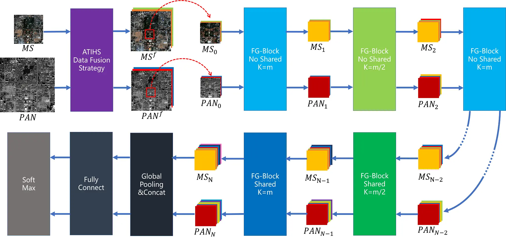

# TSMF-Net

Language: [English](README.md), [简体中文](README_zh.md)




# Cite

```
@article{liao2022tsmf,
  title={A Two-Stage Mutual Fusion Network for Multispectral and Panchromatic Image Classification},
  author={Liao, Yinuo and Zhu, Hao and Jiao, Licheng and Li, Xiaotong and Li, Na and Sun, Kenan and Tang, Xu and Hou, Biao},
  journal={IEEE Transactions on Geoscience and Remote Sensing},
  volume={60},
  pages={1--18},
  year={2022},
  publisher={IEEE}
}
```


# Environment

| Env/Package | Version  |
| :---------: | :------: |
|   python    |  3.6.10  |
|    cuda     |   10.1   |
|    torch    |  1.3.1   |
| torchvision |  0.4.2   |
|   opencv    | 4.4.0.46 |
|    gdal     |  3.0.2   |
|   libtiff   |  0.4.2   |
|    numpy    |  1.19.2  |
|   pillow    |  8.0.1   |
|    scipy    |  1.5.4   |
| hdf5storage |  0.1.18  |

Set up the environment by `requirements.txt` or `jianchao.yaml`, which are both in `extra` folder.


# Preprocess

## 1) get_vec.py

**Input:**  `msf.tif` and `pan.tif`

**Detail:**  `get_vec.py` does 2x upsampling on `msf`, reshape $(H,W,4)\to(2H,2W,4)$; And it does `2-split` operation on `pan`, reshape $(4H,4W,1)\to(2H,2W,4)$, both have the same shape at time

Then call `to_tensor()` function to normalize both of them, making data type `float32` and data range `[0,1]`

Finally they will be flattened, reshape $(2H,2W,4)\to(2H\times2W,4)$

**Output:** `msf.mat` and `pan.mat`


## 2) get_para.m

**Input:** `msf.mat` and `pan.mat`

**Detail:** Let the weight parameter of `msf` be $\alpha_i\quad(i=1,2,3,4)$ and the weight parameter of `pan` be $\beta_i\quad(i=1,2,3,4)$. Solve the following convex optimization problem:


$$
\mathop{\min}_{\alpha_i,\beta_i} \Vert \sum_{i=1}^4 \alpha_i M_i - \sum_{i=1}^4  \beta_i P_i \Vert_2^2
\\
s.t. \  \alpha_i,\beta_i>0, \ \sum_{i=1}^4  \beta_i=1
$$


**Output:** Run time `sj`, weight parameters `para` (i.e. $\alpha_i$ and $\beta_i$) and minimum value `val`

**Caution:** This MATLAB script depends on `icanfast.m`, please be careful not to delete or move it


## 3) img_fusion.py

**Input:** `msf.tif`, `pan.tif` , $\alpha_i$ and $\beta_i$

**Detail:** Refer the paper for details

**Output:** `msf_f.npy` and `pan_f.npy`

**Caution:** $\alpha_i$ and $\beta_i$ need to be modified manually in line `111,112` 


# Train&Test

### train.py

**Input:** `msf_f.npy`, `pan_f.npy` and `label.mat`

**Detail:** Train&Test in one

**Output:** `.pkl` model named after `AA`


# Visualize

### draw.py

**Input:** `msf_f.npy`, `pan_f.npy` and `label.mat`

**Detail:** Enter 0 for half and 1 for full

**Output:** `xx_half.png` and  `xx_full.png`


